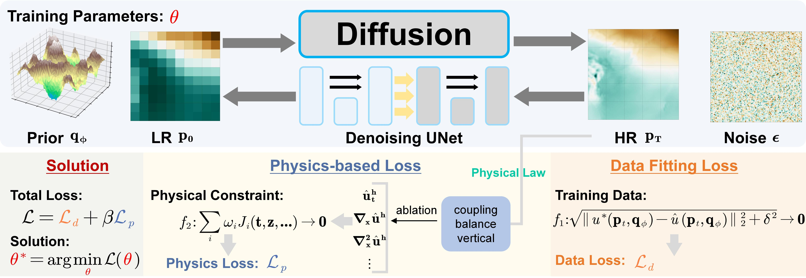

# GeoDiff
PyTorch implementation of A Diffusion Framework for Temperature Fields Reconstruction with Embedded Vertical Dynamics

### Training GeoDiff:
Simply run the following to train an encoder-decoder network using GeoDiff on the your dataset:
```
python main.py 
```

### Distributed Training
With distributed data parallel (DDP) training:
```
CUDA_VISIBLE_DEVICES=0 python main.py --nodes 2 --nr 0
CUDA_VISIBLE_DEVICES=1 python main.py --nodes 2 --nr 1
CUDA_VISIBLE_DEVICES=2 python main.py --nodes 2 --nr 2
CUDA_VISIBLE_DEVICES=N python main.py --nodes 2 --nr 3
```

## What is GeoDiff?
High-resolution meteorological data is crucial for accurate climate research and weather forecasting. However, climate change and global warming are altering the patterns in meteorological data, leading to gradual shifts in the statistical characteristics of climate variables. Existing statistical downscaling approaches primarily focus on fitting historical data while neglecting the integration of essential physical laws governing atmospheric dynamics. Although these models may perform well on past data, they risk losing accuracy when applied to future climate scenarios, particularly when faced with climate shifts or changing conditions. To address this challenge, we introduce a physics-informed framework to downscale continuous temperature fields. Our framework is designed to decompose the temperature fields into a primary deterministic component and stochastic residual component, each modeled by distinct parts of the architecture. The deterministic component reconstructs the primary temperature field, while the stochastic diffusion component captures small-scale details and uncertainties. Moreover, this framework integrates vertical dynamics by incorporating physical priors derived from the fundamental temperature variation equation, combined through zero convolution, and applied as physics priors in the downscaling process, using a 3D U-Net architecture as the encoder. The model's loss function includes Charbonnier loss for data fitting, along with static stability loss, gradient loss, and coupling loss to ensure physical consistency and accurate vertical interaction representation. Comparative experiments demonstrate that our method outperforms traditional techniques, reducing the error between downscaled results and high-resolution observations to 0.627 K, compared to 1.394 K with bicubic interpolation.

<p align="center">
  
</p>

## Usage
Simply run for single GPU or CPU training:
```
python main.py
```

For distributed training (DDP), use for every process in nodes, in which N is the GPU number you would like to dedicate the process to:
```
CUDA_VISIBLE_DEVICES=0 python main.py --nodes 2 --nr 0
CUDA_VISIBLE_DEVICES=1 python main.py --nodes 2 --nr 1
CUDA_VISIBLE_DEVICES=2 python main.py --nodes 2 --nr 2
CUDA_VISIBLE_DEVICES=N python main.py --nodes 2 --nr 3
```

`--nr` corresponds to the process number of the N nodes we make available for training.

### Testing
To test a trained model, make sure to set the `model_path` variable in the `config/config.yaml` to the log ID of the training (e.g. `logs/0`).
Set the `epoch_num` to the epoch number you want to load the checkpoints from (e.g. `4000`).

```
python eval.py
```

or in place:
```
python eval.py --model_path=./save --epoch_num=4000
```

## Logging and TensorBoard
To view results in TensorBoard, run:
```
tensorboard --logdir runs
```

## Environment

  - Python >= 3.9
  - PyTorch, tested on 1.9, but should be fine when >=1.6

## Citation

If you find our code or datasets helpful, please consider citing our related works.

## Contact

If you have questions or suggestions, please open an issue here or send an email to public_wlw@163.com.
